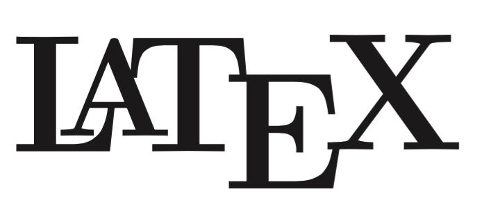

<p align="center">
  
  <br>
</p>

# LaTeX Templates

Some of my LaTeX templates.

## Setup

As the environment I use [VS Code](https://code.visualstudio.com/) with the [LaTeX Workshop](https://marketplace.visualstudio.com/items?itemName=James-Yu.latex-workshop) extension.

These are the settings that I use in combination with the in the repository contained [.editorconfig](.editorconfig):

````JSON
{
  "latex-workshop.message.update.show": false,
  "latex-workshop.view.pdf.viewer": "tab",
  "latex-workshop.latex.autoClean.run": "onBuilt",
  "latex-workshop.latex.clean.subfolder.enabled": true,
  "latex-workshop.latex.tools": [
    {
      "name": "pdflatex",
      "command": "pdflatex",
      "args": [
        "-synctex=1",
        "-interaction=nonstopmode",
        "-file-line-error",
        "%DOC%"
      ]
    },
    {
      "name": "biber",
      "command": "biber",
      "args": ["%DOCFILE%"]
    }
  ],
  "latex-workshop.latex.recipes": [
    {
      "name": "pdflatex -> biber -> pdflatex*2",
      "tools": ["pdflatex", "biber", "pdflatex", "pdflatex"]
    },
    {
      "name": "pdflatex",
      "tools": ["pdflatex"]
    }
  ]
}
````

The settings for other editors can be found [here](https://tex.stackexchange.com/questions/154751/biblatex-with-biber-configuring-my-editor-to-avoid-undefined-citations%7C).

## License

This project is licensed under the MIT License. See the [LICENSE](LICENSE) file for more details.
